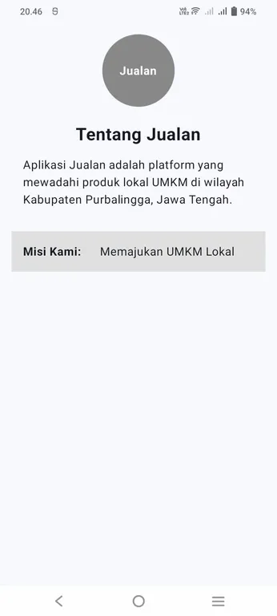
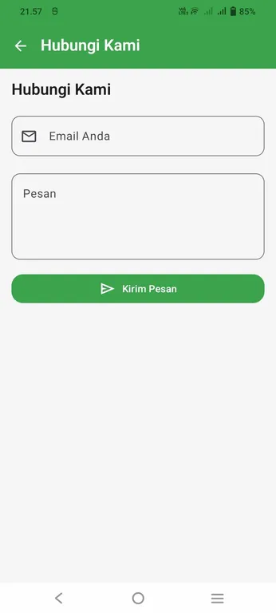
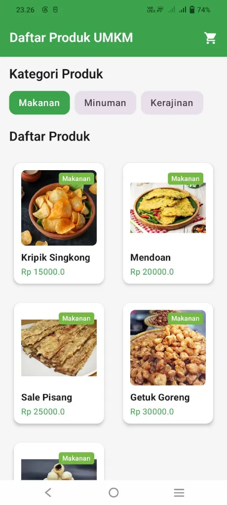
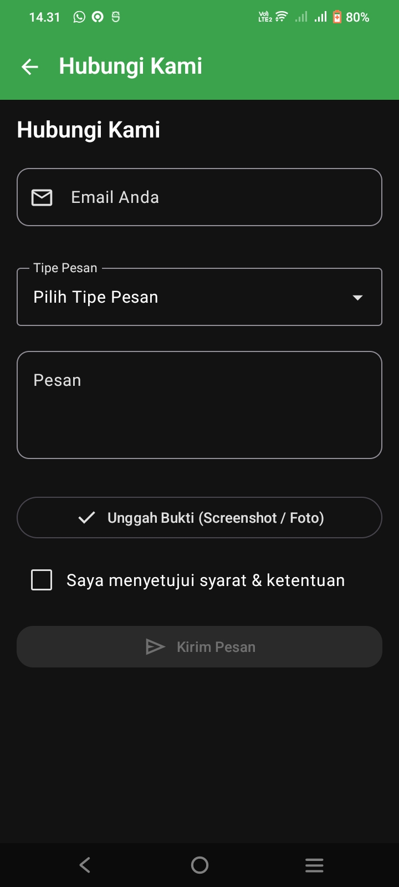
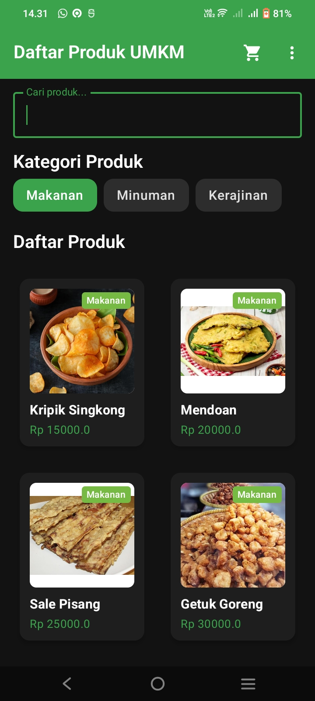
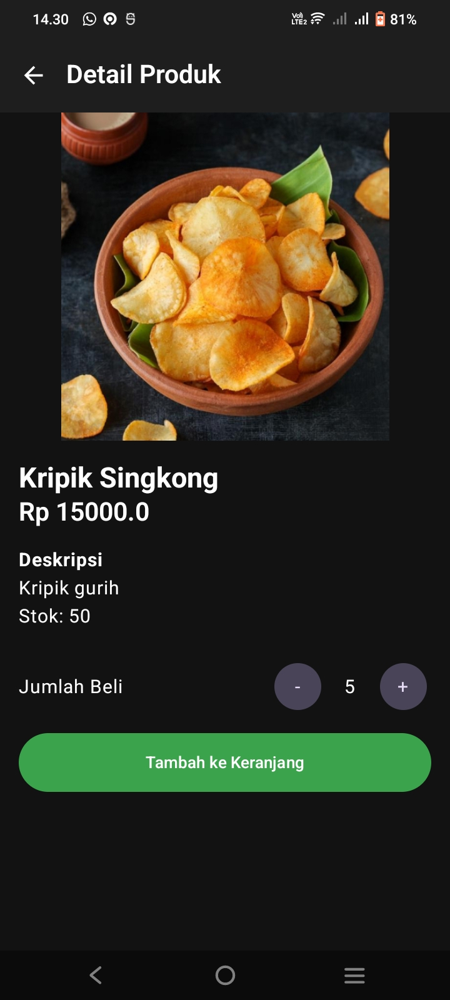
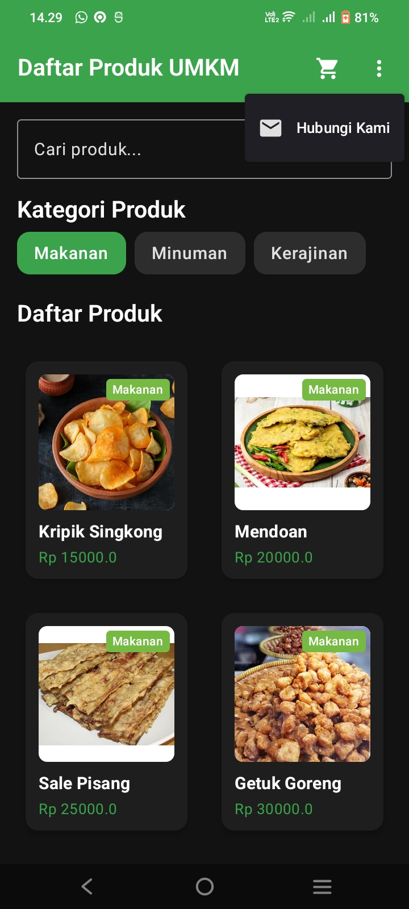

# Laporan Praktikum Pemrograman Mobile

**Nama**        : Ian Jullian Sutrisno  
**NIM**         : H1D024039  
**Shift**       : Awal I / Akhir C  
**Praktikum**   : Pemrograman Mobile

---

## 📝 Tugas Pertemuan 1
**Tanggal**: Selasa, 1 September 2026

**Kesimpulan Praktikum:**  
Pada pertemuan pertama, praktikum memberikan pemahaman dasar mengenai konsep pengembangan aplikasi mobile. Mahasiswa dapat mengenali struktur proyek, alur kerja, serta pentingnya konsistensi dalam penulisan kode agar aplikasi mudah dikembangkan dan dipelihara.

---

## 📝 Tugas Pertemuan 2
**Tanggal**: Selasa, 8 September 2026

**Kesimpulan Praktikum:**  
Pertemuan kedua menekankan pada implementasi fitur interaktif dalam aplikasi mobile. Mahasiswa belajar bagaimana menghubungkan antarmuka dengan logika program sehingga aplikasi dapat merespons input pengguna secara dinamis dan memberikan pengalaman yang lebih baik.

---

## 📝 Tugas Pertemuan 3
**Tanggal**: Selasa, 15 September 2026

**Kesimpulan Praktikum:**  
Pertemuan ketiga membuka wawasan tentang pengembangan aplikasi mobile yang lebih kompleks. Mahasiswa belajar bagaimana mengintegrasikan berbagai komponen dan fitur untuk menciptakan aplikasi yang lebih lengkap dan bermanfaat.

---

## 📝 Tugas Pertemuan 4
**Tanggal**: Selasa, 22 September 2026

   

**Kesimpulan Praktikum:**  
Pertemuan keempat memberikan pemahaman mendalam mengenai Recomposition dan UI Lifecycle dalam Jetpack Compose. Mahasiswa belajar menerapkan pengolahan state menggunakan `mutableStateOf` dan `rememberSaveable`, pola arsitektur State Hoisting yang memisahkan Stateful dan Stateless Composable, penanganan proses asinkron terikat siklus hidup UI menggunakan `LaunchedEffect`, serta implementasi navigasi antar layar dengan pengiriman argumen dinamis.
